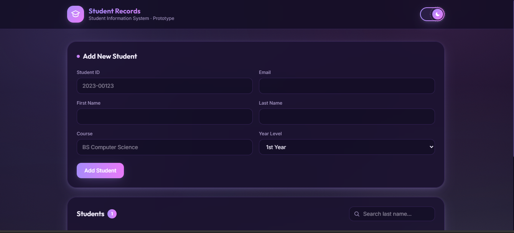
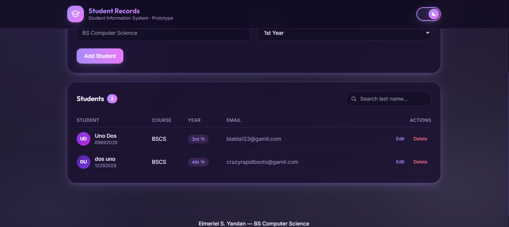
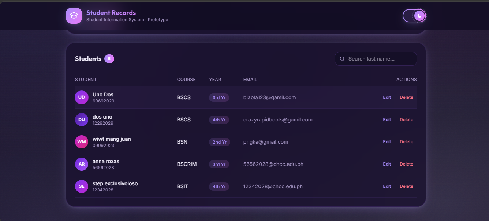
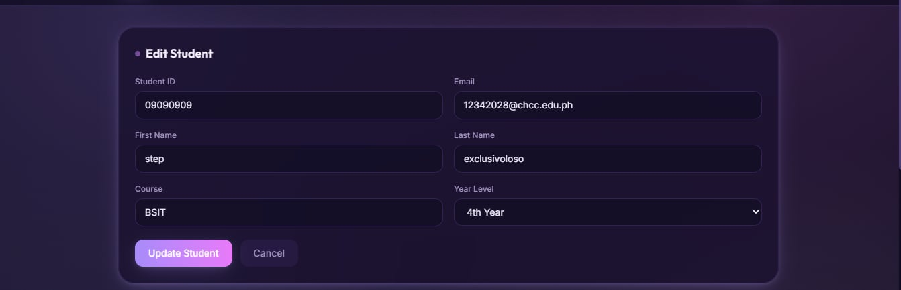
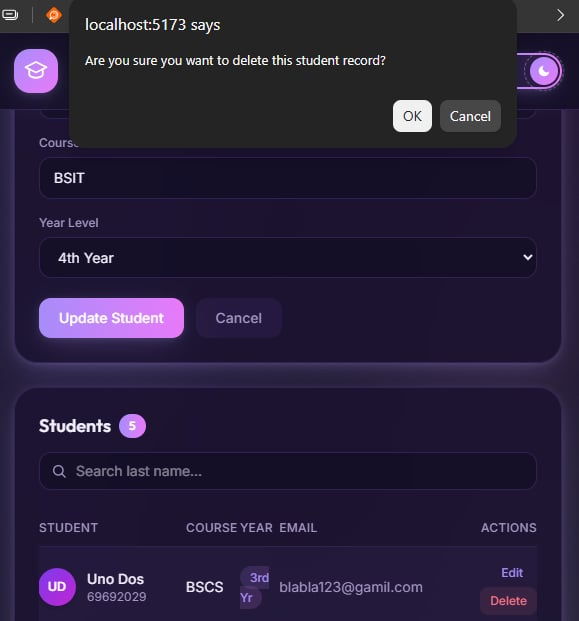
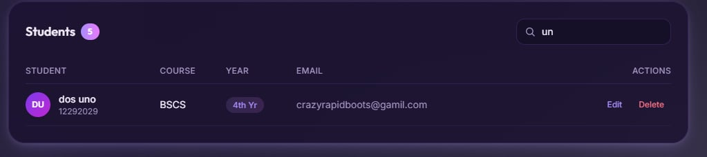
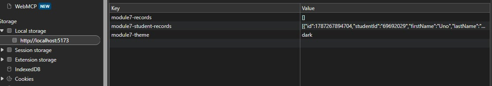
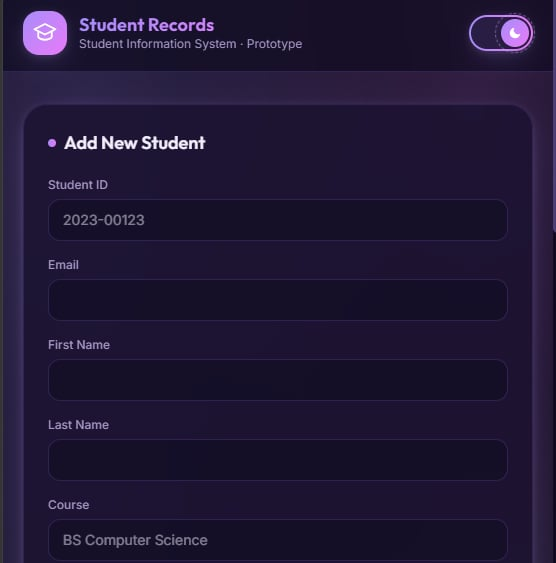
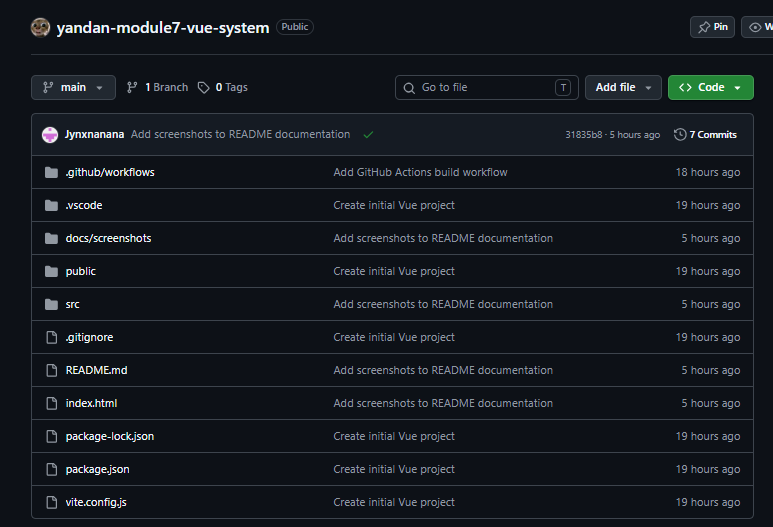
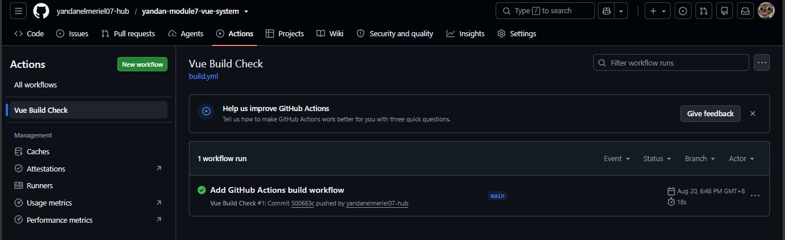

# Student Information System — Student Records Prototype

## Student Information
- Name: Elmeriel S. Yandan
- Course: BS Computer Science
- Subject: Systems Analysis and Design
- Module: Module 7 - Design and Implementation

## System Description
This prototype implements the **Students** entity from the Student Information
System proposed in Module 6. It allows administrators to add, view, edit,
delete, and search student records through a Vue.js interface styled with
Tailwind CSS.

## Selected Module 6 Entity
Students — with fields: Student ID, First Name, Last Name, Course, Year Level,
and Email (based on the `students` table in the Module 6 database plan).

## Implemented Features
- Create: Add a new student record through a validated form
- Read: View all student records in a table
- Update: Edit an existing student record
- Delete: Remove a record after confirmation
- Search: Filter records by last name
- Validation: Prevents submission with empty required fields
- Persistence: Records remain after page refresh via browser localStorage

## Technologies Used
- Vue.js 3 + Vite
- Tailwind CSS v4
- JavaScript (Composition API)
- Browser localStorage
- Git + GitHub
- GitHub Actions (CI build check)

## Installation and Run Instructions
\`\`\`bash
git clone https://github.com/USERNAME/yandan-module7-vue-system.git
cd yandan-module7-vue-system
npm install
npm run dev
\`\`\`
Open the local address shown in the terminal (e.g. http://localhost:5173/).

## About localStorage
This prototype simulates the data layer using the browser's localStorage API.
Student records are saved as JSON under the key `module7-student-records`
and are automatically loaded when the application starts, allowing data to
persist across page refreshes without a real backend or database.

## Connection Between Module 6 and Module 7
Module 6 proposed a Three-Tier Client-Server Architecture (PHP presentation
and application layers, MySQL data layer) for the full Student Information
System. Module 7 implements the presentation layer and application logic for
one entity (Students) as a working Vue.js frontend prototype, using
localStorage in place of the PHP server and MySQL database, which remain
proposed future components.

## Application Screenshots

### Running Application

### Add Record

### Record List

### Edit Record

### Delete Confirmation

### Search Function

### localStorage (Browser DevTools)

### Responsive View

### GitHub Repository

### Commit History

### CI Build Success

## Known Limitations and Future Improvements
- No real backend, API, or database connection — data is browser-local only
- No login authentication or user roles implemented yet
- Future versions will connect to the PHP application layer and MySQL
  database proposed in Module 6, and add the Users table and login module